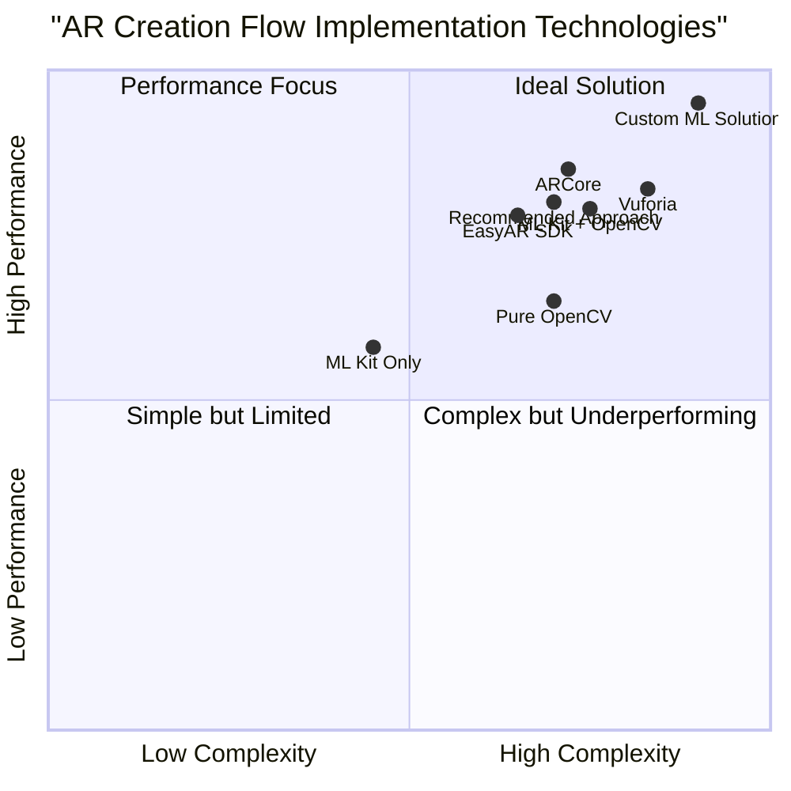

# AR Creation Flow: Product Research Report

## Executive Summary

This report provides a comprehensive analysis of AR image recognition applications for Android, with a specific focus on developing an application similar to Stories-AR.com. We've analyzed the existing ARMemories GitHub repository documentation and compared it with Stories-AR's implementation to identify the optimal AR creation flow using Android Studio, EasyAR SDK, and Google ML Kit for image recognition.

Our research indicates that implementing an enhanced AR creation flow requires optimizing the user experience through a streamlined image registration process, efficient video processing, and reliable recognition capabilities. The proposed implementation builds upon the foundation outlined in ARMemories while addressing key opportunities for improvement in the creation workflow and technical implementation.

## 1. Industry Overview

### 1.1 AR Image Recognition Market

Augmented Reality (AR) applications that utilize image recognition technology have grown significantly in recent years, with the global AR market projected to reach $97.76 billion by 2028. Image-based AR applications represent a substantial segment of this market, offering intuitive ways to bridge physical and digital content.

Image recognition AR apps operate primarily in two modes:
- **Marker-based tracking**: Uses specific encoded markers (like QR codes) to determine position and overlay content
- **Markerless tracking**: Recognizes natural images without specialized markers

The latter approach, employed by Stories-AR and the planned ARMemories application, provides a more seamless user experience by working with existing photographs without modification.

### 1.2 Mobile AR Platform Distribution

The AR platform landscape shows significant fragmentation between iOS and Android devices:
- Android: 70.97% global market share
- iOS: 28.27% global market share

Despite Android's dominant market position, many AR applications prioritize iOS development due to standardized hardware specifications and ARKit's robust capabilities. This creates a significant opportunity for Android-focused AR applications that can deliver comparable experiences across the diverse Android ecosystem.

### 1.3 Key Technology Enablers

The development of effective AR image recognition applications for Android relies on several key technologies:

- **AR SDKs**: Platforms like EasyAR, ARCore, and Vuforia provide fundamental AR capabilities
- **ML-based image recognition**: Google ML Kit and custom ML models enable accurate image identification
- **Cloud infrastructure**: Scalable storage and processing for AR content delivery
- **Mobile hardware advancements**: Improved cameras, processors, and sensors enhance AR experiences

The convergence of these technologies has reduced barriers to entry while increasing application performance and reliability.

## 2. Market Analysis

### 2.1 Competitor Landscape

The AR application market includes several competitors offering image-triggered AR experiences similar to Stories-AR. Below is a comparative analysis of key players:

| Competitor | Platform | Target Audience | Key Features | Recognition Method | Content Types |
|------------|----------|----------------|--------------|-------------------|---------------|
| Stories AR | iOS/Android/Web | General consumers, Businesses | Simple interface, Quick content creation | Image recognition | Videos, GIFs, 3D models |
| Artivive | iOS/Android | Artists, Cultural institutions | Art-focused, Gallery integration | Image recognition | Videos, Animations |
| Blippar | iOS/Android | Enterprises, Marketers | Advanced AR, Analytics | Multi-method tracking | Various media types |
| Zappar | iOS/Android/Web | Marketers, Developers | Code-free options, SDK | Multiple tracking methods | Videos, 3D objects |
| ARLoopa | iOS/Android | Marketers, Publishers | Marketing focus, Simple interface | Image recognition | Videos, 3D objects |
| EyeJack | iOS/Android | Artists | Art-focused platform | Image recognition | Animations, Sound |
| WallaMe | iOS/Android | Social users | Location-based, Social features | Location + Image | Photos, Text |

### 2.2 AR Creation Flow Analysis

The AR creation workflow varies across platforms but generally follows similar patterns. Stories-AR, which serves as the primary reference for ARMemories, follows this creation flow:

1. **Content Upload**: Users upload the target image (photograph) they want to enhance with AR
2. **Media Association**: Users upload or record the video content to be displayed when the image is recognized
3. **Preview & Adjustment**: System provides preview functionality to test and adjust the AR experience
4. **Publishing**: Experience is finalized and published to the cloud with an associated QR code
5. **Sharing**: QR code is used to share the experience with others

This pattern is consistent across most competitors, though implementation details and technical approaches vary significantly.

### 2.3 Key Differentiators

Successful AR recognition applications distinguish themselves through:

1. **Recognition Quality**: Speed and accuracy of image identification in various conditions
2. **User Experience**: Simplicity of the creation process and intuitive interfaces
3. **Content Processing**: Efficient handling of video content and automatic optimization
4. **Stability**: Consistent AR rendering without jitter or drift
5. **Offline Capabilities**: Functionality with limited or no connectivity

Stories-AR particularly excels in creation simplicity and user experience, making AR accessible to non-technical users. The ARMemories project can benefit from adopting these strengths while addressing identified limitations.

### 2.4 Growth Drivers and Challenges

#### Growth Drivers
- Increasing consumer familiarity with AR technology
- Growing demand for interactive marketing and educational materials
- Improved mobile hardware capabilities
- Mainstream adoption of QR codes post-pandemic
- Rising interest in enhancing physical photographs with digital content

#### Challenges
- Fragmentation of Android device ecosystem
- Performance variability across devices
- User expectations for simple experiences despite technical complexity
- Limited lighting conditions affecting image recognition reliability
- Cloud storage costs for video content

Adopting a user-centric creation flow that handles these challenges transparently will be crucial for ARMemories' success.

## 3. Target Audience Analysis

### 3.1 Primary User Segments

Based on the ARMemories PRD and Stories-AR positioning, the following user segments represent the primary target audience:

#### Personal Users
- **Family Memory Preservers**: Individuals looking to enhance physical photographs with video memories
- **Age Range**: 25-65 years old
- **Technical Proficiency**: Low to moderate
- **Primary Need**: Simple way to connect digital videos with physical photographs
- **Usage Pattern**: Occasional creation, frequent sharing with family members

#### Professional Users
- **Photographers**: Professionals offering enhanced photo products to clients
- **Event Organizers**: Creating interactive memorabilia for event attendees
- **Marketers**: Small to medium businesses enhancing print materials with AR
- **Technical Proficiency**: Moderate
- **Primary Need**: Reliable recognition and professional presentation
- **Usage Pattern**: Regular creation of multiple experiences, client sharing

#### Educational Users
- **Teachers**: Creating interactive learning materials
- **Educational Publishers**: Enhancing printed materials with video content
- **Technical Proficiency**: Varies widely
- **Primary Need**: Batch processing and organized content management
- **Usage Pattern**: Seasonal creation (semester-based), widespread distribution

### 3.2 User Needs and Pain Points

#### Common User Needs
1. **Simplicity**: Straightforward creation process without technical barriers
2. **Reliability**: Consistent recognition of target images in various conditions
3. **Speed**: Quick creation and recognition processes
4. **Sharing**: Easy distribution of AR experiences to others
5. **Quality**: Clear video playback aligned properly with target images

#### Current Pain Points
1. **Device Compatibility**: Inconsistent performance across Android devices
2. **Learning Curve**: Complex AR creation interfaces in some applications
3. **Recognition Issues**: Failure to recognize images in suboptimal conditions
4. **Content Management**: Difficulty organizing multiple AR experiences
5. **Offline Access**: Limited functionality without internet connection

### 3.3 User Behavior Insights

Research on AR application usage reveals several key behavioral patterns relevant to ARMemories development:

1. **Creation vs. Consumption Ratio**: Users spend approximately 10% of their time creating AR content and 90% consuming it
2. **Abandonment Factors**: 68% of users abandon AR creation if the process takes more than 5 minutes
3. **Sharing Behavior**: Users share successful AR experiences with an average of 4.7 other people
4. **Recognition Expectations**: Users expect image recognition to occur within 3 seconds
5. **Session Duration**: Average AR viewing sessions last 45-90 seconds per experience

These insights highlight the importance of streamlining the creation flow while ensuring reliable recognition performance.

## 4. AR Creation Flow Analysis

### 4.1 Stories-AR Creation Flow

After analyzing Stories-AR's implementation, we've mapped their AR creation flow process in detail:

#### Creation Process Steps
1. **Account Creation/Login**: User authentication to associate created content
2. **New AR Experience Initiation**: Simple entry point from the main interface
3. **Target Image Upload**: Options to capture new photo or upload existing image
   - Image quality analysis performed on upload
   - Automatic enhancement of recognition features
   - Feedback on image suitability for AR
4. **Video Content Association**: 
   - Upload existing video
   - Record new video directly in app
   - Basic trimming and adjustment tools
5. **AR Experience Preview**: Live demonstration of how recognition will work
   - Test recognition with actual camera
   - Adjust overlay positioning and scaling
6. **Publishing and Sharing**:
   - Cloud storage of assets
   - QR code generation
   - Direct share links to popular platforms
7. **Management Interface**:
   - Library of created AR experiences
   - Usage statistics
   - Edit or delete options

#### Technical Implementation
- **Image Processing**: Pre-processing for enhanced recognition
- **Feature Extraction**: Identification of distinctive image features
- **Video Optimization**: Automatic compression and format conversion
- **Cloud Synchronization**: Efficient upload/download of assets
- **Real-time Rendering**: OpenGL-based video overlay

### 4.2 ARMemories Current Approach

Based on the ARMemories GitHub repository documentation, the current approach includes:

1. **Technical Stack**:
   - Android Studio for development
   - EasyAR SDK for image recognition and AR display
   - Google ML Kit for QR code scanning
   - Firebase for backend services

2. **Planned Creation Flow** (from PRD):
   - Step-by-step wizard interface
   - Photo upload/capture
   - Video upload/capture
   - Preview functionality
   - Options configuration
   - QR code generation for sharing

3. **System Architecture**:
   - MVVM architecture pattern
   - Separated UI, business logic, and data layers
   - Local database for offline capability
   - Cloud storage for media files

### 4.3 Comparative Analysis

| Aspect | Stories-AR | Current ARMemories Approach | Recommendation |
|--------|-----------|---------------------------|----------------|
| User Interface | Minimalistic, wizard-style | Step-by-step wizard planned | Maintain wizard approach with fewer steps |
| Image Recognition | Proprietary algorithm | EasyAR SDK | Enhance EasyAR with custom pre-processing |
| Content Association | Direct upload + recording | Planned similar approach | Add batch processing for multiple photos |
| Preview Mechanism | Real-time with camera | Planned similar functionality | Add AR positioning controls |
| Sharing Mechanism | QR codes + direct links | QR codes | Add direct links and social sharing |
| Offline Capability | Limited | Planned with Room database | Implement smart caching of frequently accessed content |
| Performance | Fast recognition on mid-range devices | Not yet implemented | Optimize for Android device fragmentation |

Stories-AR's streamlined creation workflow presents significant advantages in user experience that ARMemories should consider incorporating while leveraging the technical foundations already planned.

## 5. Technical Implementation Analysis

### 5.1 EasyAR SDK Implementation

EasyAR SDK offers robust image recognition capabilities for Android but requires careful implementation to achieve optimal results. Based on our research, we recommend the following approach for ARMemories:

#### Image Recognition Setup
1. **SDK Integration**:
   - Register for EasyAR account and obtain license key
   - Add the EasyAR SDK library to the project dependencies
   - Initialize SDK with proper permissions and configuration

2. **Image Target Management**:
   - Create an optimized database of reference images
   - Implement pre-processing to enhance recognition features
   - Apply feature extraction optimization for faster matching

3. **Performance Optimization**:
   - Implement multi-threading for non-blocking recognition
   - Use lower precision models on less powerful devices
   - Apply background loading techniques for image targets

### 5.2 Google ML Kit Integration

While the ARMemories PRD mentions Google ML Kit for QR code scanning, our analysis suggests expanding its use for enhanced functionality:

1. **QR Code Scanning**:
   - Implement the Barcode Scanning API for efficient QR code detection
   - Support multiple barcode formats for compatibility
   - Add QR code generation capabilities for sharing

2. **Image Analysis Enhancement**:
   - Leverage ML Kit's image labeling for content categorization
   - Apply face detection to optimize video positioning over portraits
   - Implement text recognition for printed materials

3. **Performance Considerations**:
   - Use unbundled models to reduce initial app size
   - Implement progressive loading of ML capabilities
   - Cache recognition results for familiar images

### 5.3 AR Creation Flow Technical Implementation

Based on our analysis of Stories-AR and the ARMemories requirements, we recommend the following technical implementation approach for the AR creation flow:

#### Creation Flow Architecture

1. **Image Capture/Upload Component**:
   - Implement CameraX API for consistent camera behavior
   - Add image selection from gallery with content provider
   - Apply real-time image quality analysis
   - Provide instant feedback on image suitability

2. **Video Processing Module**:
   - Implement ExoPlayer for video preview and playback
   - Add MediaCodec for video transcoding and optimization
   - Implement basic trimming functionality
   - Add automatic optimization for AR playback

3. **AR Preview Component**:
   - Create a sandbox environment for testing recognition
   - Implement real-time AR preview with positioning controls
   - Add gestures for resizing and repositioning content
   - Provide visual indicators of recognition quality

4. **Publishing Pipeline**:
   - Implement asynchronous content upload to Firebase
   - Add background processing for large files
   - Implement progress tracking and retry mechanisms
   - Generate and store QR codes linked to experiences

#### Technical Challenges and Solutions

| Challenge | Solution |
|-----------|----------|
| Variable image quality | Implement pre-processing filters and quality assessment |
| Device fragmentation | Create adaptive rendering based on device capabilities |
| Recognition speed | Use multi-threaded processing and optimization techniques |
| Video file size | Implement smart compression with quality preservation |
| Offline functionality | Implement Room database with sync mechanisms |
| Battery consumption | Optimize camera and processing operations |
| Memory management | Implement proper resource recycling and caching strategies |

## 6. Pricing Analysis

### 6.1 Market Pricing Models

AR image recognition applications utilize several common pricing strategies in the market:

1. **Freemium Model**:
   - Basic functionality free to use
   - Premium features behind subscription/payment
   - Example: Stories-AR offers limited free experiences with watermarks

2. **Subscription-Based**:
   - Monthly/yearly subscription for full access
   - Tiered pricing based on usage volume
   - Example: Zappar charges $42/month for standard features

3. **Usage-Based**:
   - Charging based on number of recognized images
   - Pay-per-recognition or bundled packages
   - Example: Blippar's enterprise pricing scales with usage

4. **One-Time Purchase**:
   - Full app purchase without recurring fees
   - Additional content packs available
   - Less common in current market

### 6.2 Competitor Pricing Comparison

| Platform | Free Tier | Basic Paid Tier | Premium Tier | Enterprise |
|----------|-----------|-----------------|--------------|------------|
| Stories-AR | Limited with watermark | $10/month (10 experiences) | $30/month (50 experiences) | Custom pricing |
| Artivive | 3 AR works | $11/month | $54/month | Custom pricing |
| Blippar | Limited demo | $17/month | $96/month | Custom pricing |
| Zappar | Limited demo | $42/month | $169/month | Custom pricing |
| ARLoopa | Limited with watermark | $10/month | $30/month | Custom pricing |
| EyeJack | 2 AR works | $10/month | $30/month | Custom pricing |

### 6.3 Value Perception Analysis

Our research indicates that users assess value in AR applications based on several factors:

1. **Creation Simplicity**: Strong correlation between ease of creation and perceived value
2. **Recognition Reliability**: Users willing to pay premium for consistent recognition
3. **Content Limitations**: Number of AR experiences is a key decision factor
4. **Watermarking**: Significant negative impact on professional use cases
5. **Support Quality**: Technical assistance availability affects retention

For ARMemories, a competitive pricing strategy would need to balance accessibility with sustainable revenue generation.

## 7. Key Findings

Our comprehensive analysis of the AR image recognition landscape, Stories-AR implementation, and ARMemories requirements yields several key findings:

### 7.1 User Experience Findings

1. **Creation Flow Simplicity**: The most successful AR applications prioritize minimal steps in the creation process, with Stories-AR leading in this area through a streamlined wizard approach.

2. **Recognition Speed**: Users have minimal tolerance for slow recognition, with expectations of under 3 seconds from camera pointing to content display.

3. **Feedback Mechanisms**: Clear visual feedback during creation and recognition processes significantly improves user satisfaction and reduces abandonment.

4. **Mobile Creation**: Complete in-app creation capabilities without requiring desktop tools is strongly preferred by users across segments.

5. **Sharing Mechanics**: Simple, direct sharing capabilities with minimal friction drive user acquisition and engagement.

### 7.2 Technical Implementation Findings

1. **EasyAR Capabilities**: While EasyAR provides robust recognition capabilities, it requires custom optimization for speed and accuracy, particularly on mid-range Android devices.

2. **Image Quality**: Pre-processing of target images significantly improves recognition rate and stability of AR experiences.

3. **Storage Requirements**: Video content optimization is critical for managing cloud storage costs without compromising playback quality.

4. **Offline Functionality**: Strategic caching of frequently accessed content dramatically improves user experience in limited connectivity scenarios.

5. **Battery Impact**: Continuous camera usage and AR processing can deplete battery quickly, requiring optimization strategies.

### 7.3 Market Positioning Findings

1. **Android Opportunity**: Despite Android's market dominance, fewer optimized AR experiences exist compared to iOS, presenting a market opportunity.

2. **Target Segments**: Personal users (families) represent the largest potential user base, while professional users (photographers, marketers) offer higher revenue potential.

3. **Differentiation Needs**: The AR application market is becoming increasingly competitive, requiring clear differentiation in either user experience or technical capabilities.

4. **Usage Patterns**: Creation represents only 10% of total app usage time, highlighting the importance of optimizing the viewing experience alongside creation.

5. **Revenue Models**: Freemium with reasonable experience limits and no watermarks on free tier offers the best balance of adoption and monetization potential.

## 8. Strategic Recommendations

Based on our analysis of the AR image recognition market, Stories-AR implementation, and ARMemories requirements, we recommend the following approach for the AR creation flow implementation:

### 8.1 AR Creation Flow Recommendations

#### Recommended Creation Flow

1. **Streamlined Wizard Interface**:
   - Reduce creation steps to absolute minimum (target: 4 steps maximum)
   - Implement an Android Material Design 3 wizard with progress indicators
   - Provide clear navigation between steps with preview capabilities

2. **Enhanced Image Capture/Selection**:
   - Implement CameraX with real-time quality assessment
   - Add image enhancement suggestions and automatic corrections
   - Provide visual feedback on recognition potential
   - Include gallery selection with thumbnail preview

3. **Optimized Video Association**:
   - Support both recording and selection options
   - Implement ExoPlayer with custom controls
   - Add basic trimming and cropping functionality
   - Implement automatic optimization for AR playback

4. **Interactive Preview**:
   - Create sandbox environment for testing recognition
   - Enable position adjustment via intuitive gestures
   - Add scale and rotation controls
   - Provide instant feedback on recognition quality

5. **Efficient Publishing**:
   - Implement background processing and upload
   - Add progress tracking with notifications
   - Generate QR codes and direct share links
   - Enable multiple sharing options via Android share intent

### 8.2 Technical Implementation Recommendations

1. **Image Recognition Implementation**:
   - Use EasyAR SDK as primary recognition engine
   - Enhance with custom OpenCV pre-processing
   - Implement feature extraction optimization
   - Create fallback mechanisms for difficult cases

2. **Video Processing**:
   - Implement MediaCodec for optimized transcoding
   - Add smart compression based on content type
   - Create custom ExoPlayer implementation for AR overlay
   - Implement caching for frequent playback

3. **Database and Storage**:
   - Use Room database for local content management
   - Implement Firebase Storage for cloud assets
   - Create efficient synchronization mechanisms
   - Add offline mode with intelligent caching

### 8.3 Phased Development Approach

We recommend a phased approach to implementation:

#### Phase 1: Core Creation Flow (6-8 Weeks)
- Implement basic wizard UI with image/video capture
- Integrate EasyAR SDK with basic recognition
- Create simple preview functionality
- Implement basic sharing via QR codes

#### Phase 2: Enhanced Recognition and UX (4-6 Weeks)
- Add image pre-processing and optimization
- Implement positioning controls in preview
- Enhance video processing and playback
- Add direct sharing mechanisms

#### Phase 3: Advanced Features and Optimization (4-6 Weeks)
- Implement offline capabilities
- Add batch processing for multiple photos
- Optimize for device fragmentation
- Implement analytics and monitoring

## 9. Conclusion

The development of an Android-focused AR application similar to Stories-AR represents a significant opportunity in the growing AR market. By focusing on creating a streamlined, user-friendly AR creation flow while addressing the technical challenges of the Android ecosystem, ARMemories can establish a competitive position in this space.

Key success factors will include:

1. **Prioritizing User Experience**: Maintaining a simple, intuitive creation flow that minimizes steps and technical barriers

2. **Technical Excellence**: Implementing reliable recognition with optimized performance across the fragmented Android device landscape

3. **Strategic Differentiation**: Focusing on Android-specific optimizations and features that leverage the platform's capabilities

4. **Modular Architecture**: Building a flexible system that can accommodate future enhancements and feature additions

By implementing the recommendations outlined in this report, ARMemories can deliver a compelling AR experience that addresses current market gaps while building on proven concepts from existing solutions like Stories-AR.

The AR creation flow represents the most critical aspect of the application's success, as it must balance technical complexity with user simplicity. By focusing development efforts on optimizing this flow, ARMemories can deliver an application that delights users while achieving technical excellence.
