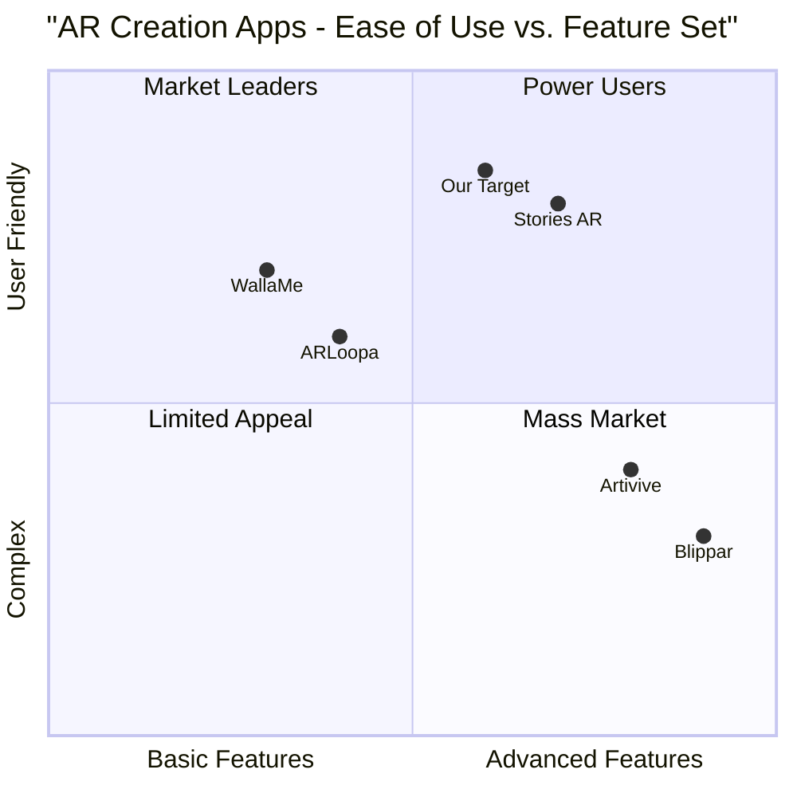

# Phase 1: AR Stories Android Application PRD

## Project Information
- **Project Name**: ar_stories_phase1
- **Platform**: Android
- **Primary Technologies**: 
  - Android Development
  - EasyAR SDK
  - Google ML Kit

## Original Requirements
Implement Phase 1 core creation flow of an AR Stories application similar to stories-ar.com, focusing on:
- Basic wizard UI with image/video capture
- EasyAR SDK integration with basic recognition
- Simple preview functionality
- QR code sharing implementation

## Product Definition

### Product Goals
1. Deliver a functional AR content creation and viewing experience on Android devices
2. Establish reliable image recognition and AR content overlay system
3. Implement seamless sharing mechanism through QR codes

### User Stories
1. As a content creator, I want to easily capture/upload photos and videos through a guided wizard interface so that I can create AR experiences without technical expertise
2. As a viewer, I want to scan QR codes and see AR content overlaid on physical photos so that I can experience interactive memories
3. As a user, I want to preview my AR creation before sharing so that I can ensure the experience works as intended

### Competitive Analysis
1. Stories AR
   - Pros: Intuitive UI, smooth AR experience
   - Cons: iOS-first approach, subscription model

2. Artivive
   - Pros: Stable tracking, good documentation
   - Cons: Complex creation process, art-focused

3. ARLoopa
   - Pros: Android-native, simple sharing
   - Cons: Limited creation options, basic UI

4. WallaMe
   - Pros: Free to use, social features
   - Cons: Limited AR stability, focus on location-based AR

5. Blippar
   - Pros: Advanced tracking, enterprise features
   - Cons: Complex interface, expensive

### Competitive Quadrant Chart

## Technical Specifications

### Requirements Analysis
Core functionalities required for Phase 1:
1. Camera integration for photo/video capture
2. EasyAR SDK implementation for image recognition
3. Video overlay rendering system
4. QR code generation and scanning
5. Basic content management system
6. User interface for guided creation

### Requirements Pool

#### P0 (Must-Have)
1. Camera Access and Media Capture
   - Camera permission handling
   - Photo capture functionality
   - Video recording capability (up to 30 seconds)
   - Basic media quality checks

2. AR Creation Wizard
   - Step-by-step interface
   - Media upload options
   - Basic editing capabilities
   - Preview functionality

3. EasyAR Integration
   - Image tracking initialization
   - Target image processing
   - Video overlay rendering
   - Performance optimization

4. QR Code System
   - QR code generation
   - Scanning functionality
   - Content linking

5. Basic Storage
   - Local content caching
   - Cloud upload/download
   - File management

#### P1 (Should-Have)
1. Enhanced Preview
   - Real-time preview
   - Adjustment options
   - Playback controls

2. Error Handling
   - Connection issues
   - Recognition failures
   - Storage limitations

3. Performance Optimization
   - Load time reduction
   - Memory management
   - Battery optimization

#### P2 (Nice-to-Have)
1. Tutorial System
2. Basic Analytics
3. Offline Mode
4. Multiple Format Support

### UI Design Draft

#### Creation Flow Screens
1. Welcome Screen
   - Camera permission request
   - Start creation button
   - Tutorial option

2. Media Capture Screen
   - Camera viewfinder
   - Capture button
   - Gallery upload option
   - Format selection (photo/video)

3. Preview Screen
   - AR preview window
   - Adjustment controls
   - Continue/Retry options

4. Share Screen
   - QR code display
   - Share options
   - Save locally option

#### Viewing Flow Screens
1. Scanner Screen
   - QR code scanner
   - Recent items
   - Help button

2. AR View Screen
   - Full-screen camera
   - Loading indicator
   - Minimal controls

### Implementation Plan

#### Week 1-2: Setup & Basic UI
- Project setup with Android Studio
- EasyAR SDK integration
- Basic UI implementation
- Camera integration

#### Week 3-4: Core AR Features
- Image recognition setup
- Video overlay system
- Basic preview functionality
- Performance testing

#### Week 5-6: Content Management
- Storage system implementation
- Cloud integration
- QR code system
- Error handling

#### Week 7-8: Polish & Testing
- UI refinement
- Performance optimization
- Bug fixing
- User testing

### Technical Requirements

#### Minimum Device Requirements
- Android 7.0 (API 24) or higher
- 2GB RAM
- Camera with autofocus
- 100MB storage space

#### Development Requirements
- Android Studio Arctic Fox or newer
- EasyAR SDK 4.0+
- Google ML Kit (Barcode scanning)
- Firebase integration

### Open Questions
1. What is the maximum supported video length for AR experiences?
2. How should we handle different aspect ratios in captured media?
3. What are the specific performance metrics we need to meet?
4. How should we implement content expiration for shared experiences?
5. What security measures are needed for QR code content?

### Success Metrics
1. Technical Metrics
   - App launch time < 3 seconds
   - AR recognition time < 2 seconds
   - Frame rate > 24 FPS during AR playback
   - Crash rate < 1%

2. User Experience Metrics
   - Creation flow completion rate > 80%
   - Average creation time < 2 minutes
   - QR code scan success rate > 95%

### Next Steps
1. Development environment setup
2. EasyAR SDK integration testing
3. Basic UI implementation
4. Camera and media capture setup