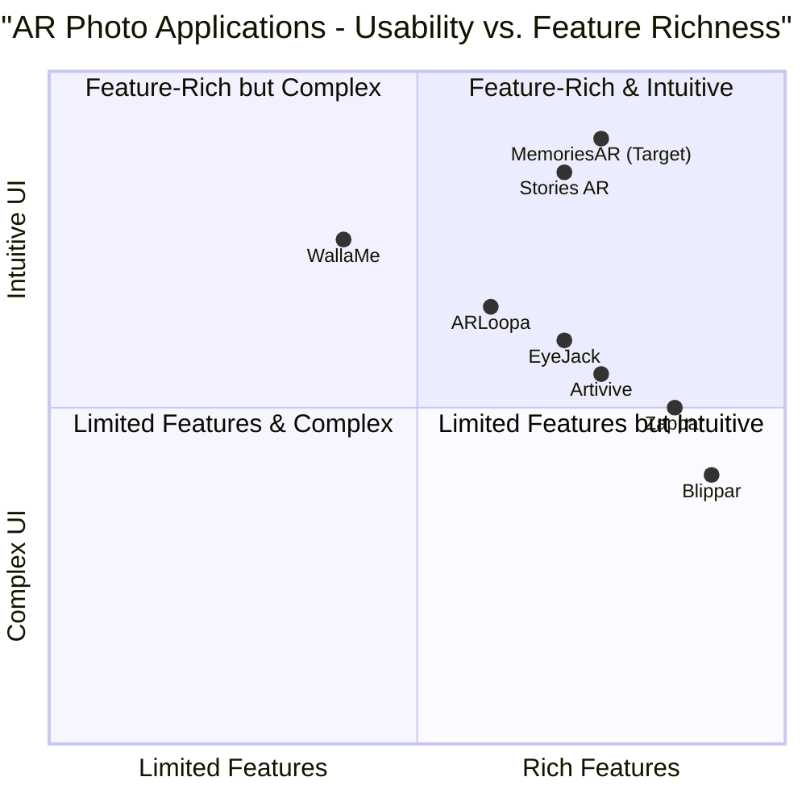

# Product Requirements Document: MemoriesAR

## Project Overview

### Project Name
memories_ar

### Original Requirements
Create an Android application similar to Stories AR (https://stories-ar.com) that integrates memories into pictures using the following technologies:
- Android Studio for development
- EasyAR SDK for augmented reality functionality
- Google ML Kit for QR code scanning

The application should allow users to attach videos to physical photos, creating interactive AR experiences when viewed through the app.

### Language
- Application Language: English
- Programming Language: Java/Kotlin for Android

## Product Definition

### Product Goals
1. Create a user-friendly Android application that brings static photographs to life through augmented reality video overlays
2. Provide a seamless experience for creating, sharing, and viewing AR-enhanced photographs
3. Develop a reliable system for recognizing images and displaying associated video content with minimal latency

### User Stories
1. As a family member, I want to attach video memories to physical photographs so that I can share more complete memories with loved ones.
2. As a photographer, I want to create interactive photo albums that display videos when viewed through the app so that I can offer unique products to my clients.
3. As a business owner, I want to enhance my marketing materials with AR content so that I can engage customers with interactive media.
4. As an event organizer, I want to create memorable keepsakes by linking videos to event photos so that attendees can relive the experience.
5. As an educator, I want to attach instructional videos to printed materials so that students can access additional content through AR.

### Competitive Analysis

1. **Stories AR**
   - Pros: Simple interface, quick content creation, supports various mediums, cross-platform (iOS/Android)
   - Cons: Subscription-based model, watermarks on free version, limited customization

2. **Artivive**
   - Pros: Focuses on art, good tracking capabilities, established in the art community
   - Cons: Less intuitive for casual users, primarily aimed at artists, higher pricing

3. **Blippar**
   - Pros: Advanced AR capabilities, versatile content creation, analytics
   - Cons: Steeper learning curve, enterprise focus, expensive for individuals

4. **Zappar**
   - Pros: Robust AR creation tools, code-free options, multiple tracking methods
   - Cons: Feature limitations on free tier, mobile creation experience limited

5. **ARLoopa**
   - Pros: Multiple AR features, good for marketing, simple interface
   - Cons: Less stable tracking in some environments, limited customization

6. **EyeJack**
   - Pros: Art-focused AR platform, good content management, established user base
   - Cons: Limited free options, primarily focused on artists rather than casual users

7. **WallaMe**
   - Pros: Location-based AR, social features, free to use
   - Cons: Different focus (location vs. image recognition), smaller user base, limited features

### Competitive Quadrant Chart

## Technical Specifications

### Requirements Analysis
The application must provide an end-to-end solution for creating, sharing, and viewing augmented reality content tied to physical photographs. The system should minimize technical barriers while maintaining robust performance across various Android devices. Key technical needs include:

1. Accurate and fast image recognition
2. Stable AR content display with proper positioning and scaling
3. Efficient video processing and playback
4. User-friendly content creation workflow
5. QR code generation and scanning functionality
6. Secure cloud storage and retrieval of AR content
7. Offline capability for previously downloaded content
8. Cross-device sharing functionality
9. User account management
10. Performance optimization for various Android devices

### Requirements Pool

#### P0 (Must-Have)
1. Android application that allows viewing AR content linked to physical photographs
2. Image recognition capabilities to identify target photos
3. Video playback functionality overlaid on recognized images
4. QR code scanning to access AR experiences
5. Simple interface for creating AR experiences (upload photo + video)
6. User account creation and authentication
7. Cloud storage for user content
8. Ability to share AR experiences via QR codes/links
9. App permissions management (camera, storage, internet)
10. Basic error handling and crash reporting

#### P1 (Should-Have)
1. Content management system for user's AR creations
2. Video trimming and basic editing capabilities
3. Adjustable AR content positioning and scaling
4. Usage statistics for creators (views, unique users)
5. Multiple AR experiences linked to a single QR code
6. Offline mode for previously viewed content
7. Push notifications for shared content
8. In-app tutorial and help section
9. Content categorization and organization
10. Customizable QR codes

#### P2 (Nice-to-Have)
1. Advanced video editing features
2. AR effects and filters
3. Multi-language support
4. Integration with social media platforms
5. Location-based AR experiences
6. Collaborative AR creation
7. Custom animations and transitions
8. Business analytics dashboard
9. White-label solution for businesses
10. AR watermarking options

### System Architecture
The application will be structured using the MVVM (Model-View-ViewModel) architecture pattern for clean separation of concerns and better testability. Key components include:

1. **User Interface Layer**
   - Activities and Fragments for user interaction
   - ViewModels to manage UI-related data
   - Data Binding for UI updates

2. **Business Logic Layer**
   - Use cases for core functionality
   - Repositories for data access
   - Service interfaces for external systems

3. **Data Layer**
   - Local database (Room) for offline capability
   - Remote data sources (API clients)
   - File storage management

4. **Core AR Components**
   - EasyAR SDK integration for image tracking and AR display
   - Google ML Kit integration for QR code scanning
   - Video processing and rendering services

### UI Design Draft

#### Main Screens

1. **Splash Screen**
   - App logo and loading indicator
   - Quick authentication check

2. **Home Screen**
   - Camera viewfinder (main function)
   - Menu access
   - Recent AR experiences
   - Create new AR button (prominent)

3. **AR Creation Screen**
   - Step-by-step wizard interface
   - Photo upload/capture
   - Video upload/capture
   - Preview functionality
   - Options configuration

4. **AR Viewing Experience**
   - Full-screen camera view
   - Minimal UI during AR experience
   - Share, save, and like options
   - Return to home button

5. **Profile and Content Management**
   - User profile information
   - Created AR experiences library
   - Usage statistics
   - Account settings

6. **Settings**
   - App configuration
   - Notification preferences
   - Storage management
   - Help and support

### Technical Implementation Details

#### EasyAR SDK Integration

The application will utilize EasyAR SDK for the following functions:
- Image tracking and recognition
- AR content rendering and display
- Camera feed processing
- Spatial positioning of virtual content

Key EasyAR features to implement:
- Planar Image Tracking for photograph recognition
- Video texture rendering for memory playback
- Camera calibration and optimization

#### Google ML Kit Integration

Google ML Kit will be used for:
- QR code detection and decoding
- Barcode scanning for accessing AR experiences
- Image labeling for content organization (optional)

#### Cloud Architecture

The backend will utilize:
- Firebase Authentication for user management
- Firebase Cloud Storage for media files
- Firebase Firestore for metadata and user data
- Firebase Cloud Functions for server-side processing

#### Data Flow

1. **AR Creation Flow**
   - User uploads/captures photo and video
   - Media processed and optimized for AR
   - Content uploaded to cloud storage
   - QR code generated linking to experience
   - Metadata stored in database

2. **AR Viewing Flow**
   - User scans QR code with app
   - App retrieves experience metadata
   - App downloads necessary media assets
   - EasyAR recognizes target image
   - Video content displayed over recognized image

### Performance Requirements

1. **Launch Time**
   - App must launch within 3 seconds on mid-range devices
   - Camera access within 5 seconds of launch

2. **Recognition Speed**
   - Image recognition must initiate within 1 second of pointing camera
   - Recognition confirmation within 3 seconds in proper lighting conditions

3. **Video Playback**
   - Video playback must start within 2 seconds of recognition
   - Stable frame rate of at least 24 FPS during playback
   - Proper synchronization between image and video

4. **Resource Usage**
   - Memory usage under 300MB during normal operation
   - CPU usage below 40% during AR viewing
   - Battery consumption optimized for extended use

### Hardware Requirements

**Minimum Requirements**
- Android 7.0 (Nougat) or later
- 2GB RAM
- Camera with autofocus
- Gyroscope and accelerometer
- 200MB available storage
- Internet connection for initial content download

**Recommended Requirements**
- Android 9.0 (Pie) or later
- 4GB RAM
- High-quality rear camera
- Gyroscope, accelerometer, and magnetometer
- 1GB available storage
- High-speed internet connection

## Open Questions

1. Should we implement a freemium model similar to Stories AR, or pursue a different monetization strategy?
2. What are the specific limitations of EasyAR SDK that might impact our development timeline or feature set?
3. How can we optimize the image recognition to work with poor lighting conditions or partially obscured photos?
4. Should we prioritize offline functionality for rural users with limited connectivity?
5. What measures should be taken to ensure content privacy and security?
6. How will we handle copyright concerns for user-uploaded content?
7. Should we implement batch processing for multiple AR experiences creation?
8. What analytics should we track to improve user experience and app performance?
9. How can we ensure compatibility across the fragmented Android device ecosystem?
10. Should we consider a web-based creator portal in addition to the mobile app?

## Implementation Roadmap

### Phase 1: MVP (2 months)
- Basic app structure and UI
- EasyAR integration for image recognition
- Google ML Kit integration for QR scanning
- Simple AR experience creation
- Basic cloud storage and retrieval
- User authentication
- Essential error handling

### Phase 2: Core Features (3 months)
- Enhanced content creation tools
- Content management system
- Improved AR experience quality
- Offline capabilities
- Usage statistics
- Multiple experiences per QR code
- In-app help and tutorials

### Phase 3: Advanced Features (3 months)
- Advanced video editing
- AR effects and filters
- Social sharing integration
- Business features
- Analytics dashboard
- Performance optimizations
- Multi-language support

### Phase 4: Refinement (2 months)
- User feedback incorporation
- UI/UX improvements
- Performance optimization
- Bug fixes and stability improvements
- Additional platform-specific optimizations

## Appendix

### Setting Up Developer Environment

1. **Android Studio Setup**
   - Download and install Android Studio (latest version)
   - Configure Android SDK with API level 24 (Android 7.0) or higher
   - Install required SDK tools and platform tools

2. **EasyAR SDK Integration**
   - Register for an EasyAR account at https://www.easyar.com
   - Generate API keys for development and production
   - Download EasyAR SDK for Android
   - Add SDK to project dependencies
   - Configure application manifest with required permissions
   - Initialize EasyAR in application class

3. **Google ML Kit Setup**
   - Create a Firebase project
   - Register application with Firebase
   - Add google-services.json to project
   - Add ML Kit dependencies to build.gradle
   - Initialize ML Kit in application class

4. **Firebase Configuration**
   - Set up Firebase Authentication
   - Configure Cloud Storage
   - Initialize Firestore database
   - Set up security rules for data access

### API Key Management

The following API keys will need to be configured:

1. **EasyAR SDK Key**
   - Location: `/app/src/main/res/values/keys.xml` (create this file)
   - Format: `<string name="easyar_key">YOUR_KEY_HERE</string>`

2. **Firebase Configuration**
   - Location: `/app/google-services.json` (downloaded from Firebase console)
   - No manual editing required, but file must be present

3. **Other API Keys**
   - All keys should be stored in the keys.xml file
   - This file should be added to .gitignore to prevent accidental exposure

### Important Resources

1. **EasyAR Documentation**
   - Developer Portal: https://www.easyar.com/developer/
   - SDK Documentation: https://www.easyar.com/doc/
   - Sample Code: https://github.com/easyar-dev/

2. **Google ML Kit Documentation**
   - Overview: https://developers.google.com/ml-kit
   - Barcode Scanning: https://developers.google.com/ml-kit/vision/barcode-scanning

3. **Android Development**
   - Android Developer Guides: https://developer.android.com/guide
   - Camera API: https://developer.android.com/training/camera
   - CameraX: https://developer.android.com/training/camerax

4. **Firebase Resources**
   - Console: https://console.firebase.google.com/
   - Documentation: https://firebase.google.com/docs